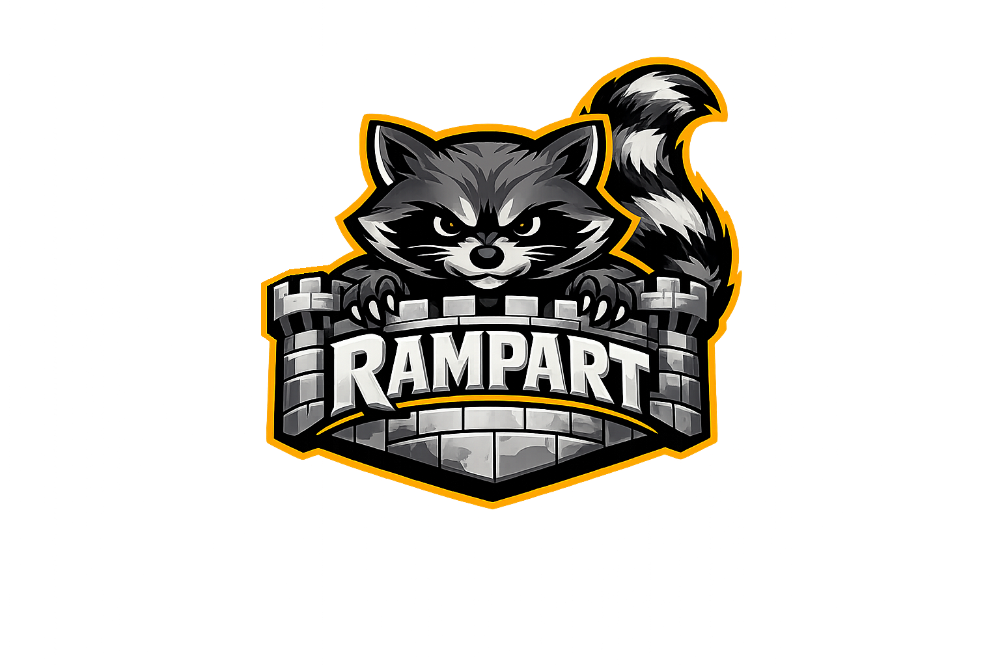

  

# RAMPART: Risk Assessment & Measurement Platform for Agentic Red Teaming

**A pytest-native safety and security testing framework for agentic AI applications.**

RAMPART provides a structured, developer-friendly way to write and run safety and security tests for AI agents -- covering **adversarial attacks**, **benign failures**, and a broad range of **harm categories**, all with evaluation-driven assertions and seamless integration with [pytest](https://docs.pytest.org/).

## Trademarks

This project may contain trademarks or logos for projects, products, or services. Authorized use of Microsoft
trademarks or logos is subject to and must follow
[Microsoft's Trademark & Brand Guidelines](https://www.microsoft.com/legal/intellectualproperty/trademarks/usage/general).
Use of Microsoft trademarks or logos in modified versions of this project must not cause confusion or imply Microsoft sponsorship.
Any use of third-party trademarks or logos are subject to those third-party's policies.
